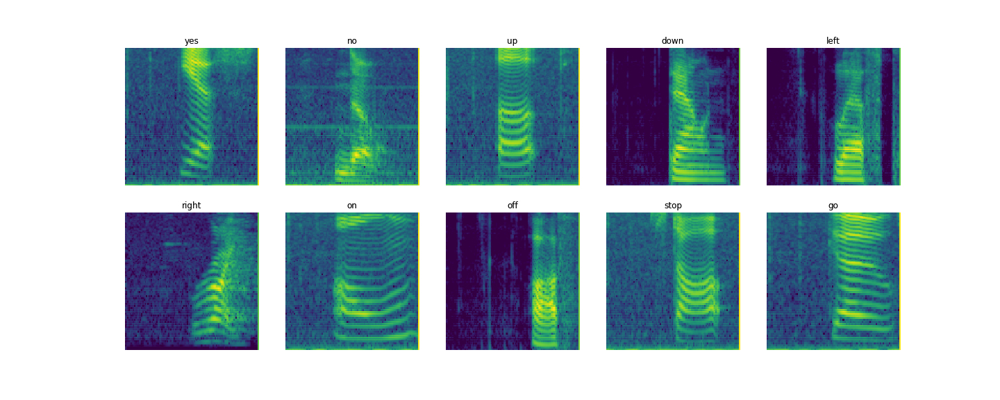

Solution for [TensorFlow Speech Recognition Challenge](https://www.kaggle.com/c/tensorflow-speech-recognition-challenge) on Kaggle (125th place, top 10%).
I used mel-scaled spectrograms and mel-frequency cepstral coefficients as inputs
for two [NASNet-A](https://research.googleblog.com/2017/11/automl-for-large-scale-image.html) Convolutional Neural Networks and then averaged their predictions.

### Competition
In the competition, we were given a Speech Commands Datasets which includes 65,000 one-second long utterances of 30 short words, by thousands of different people. The goal is to assign one of the following 12 labels to each command: yes, no, up, down, left, right, on, off, stop, go, silence, unknown.

### My solution
I used PyTorch to train two NASNet-A Convolutional Neural Networks. The First network was trained on mel-scaled spectrograms, the second - on mel-frequency cepstral coefficients. Then I averaged their predictions to make a final submission.

Examples of mel-scaled spectrograms for speech commands:


### Directory structure
The code expects the following directory structure:
```
input/
├── train/
    ├──  audio/
    └── ...
├── test/
    ├──  audio/
    └── ...
└── sample_submission.csv
code/
├── __init__.py
├── augmentation_transforms.py
├── custom_transforms.py
├── config.py
└── ...
predictions/
└── ...
saved_models/
└── ...
submissions/
└── ...
```

### Requirements
- Python 3.6
- PyTorch 0.4.0a0. If you want to use version 0.3, you need to modify [train.py](train.py) and [predict.py](predict.py) files: 
  - remove [`with torch.no_grad`](train.py#L98) and pass [`volatile=True`](train.py#L42-L43) when you are creating Variables while running `forward_pass` in a validation mode).
  - remove [`with torch.no_grad`](predict.py#L56) and pass [`volatile=True`](predict.py#L58) when you are creating a Variable.
- Libraries from requirements.txt

### To run the code
- Adjust config variables in config.py
- Execute run.sh file
